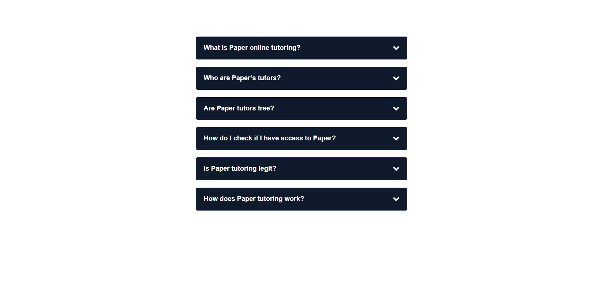

## Table of contents

- [Overview](#overview)
  - [Screenshot](#screenshot)
  - [Links](#links)
- [My process](#my-process)
  - [Built with](#built-with)
  - [Notes](#notes)
  - [Continued development](#continued-development)
  - [Useful resources](#useful-resources)
- [Author](#author)

## Overview

Users path:

- View the optimal layout for the component depending on their device's screen size
- See hover states for all interactive elements on the page
- Hide/Show the answer to a question when the question is clicked

### Screenshot




### Links

- Solution URL: [Github](https://github.com/SteveNoyes/FAQfeaturette)
- Live Site URL: [Github Pages](https://stevenoyes.github.io/FAQfeaturette/)

## My process

### Built with

- HTML5 
- Mobile-first workflow
- JavaScript
- CSS
- [SCSS](https://blog.logrocket.com/the-definitive-guide-to-scss/)

### Notes

```js
$("i.fa-chevron-down", this).toggleClass("chevron-top");
      $("#" + accordionitem)
        .parent()
        .siblings()
        .find(".accordion-title i.fa-chevron-down")
        .removeClass("chevron-top");
```

### Continued development

### Useful resources

- [w3schools](https://www.w3schools.com/howto/howto_js_accordion.asp) - This helped me for XYZ reason. I really liked this pattern and will use it going forward.

- [Reset CSS](https://meyerweb.com/eric/tools/css/reset/) - This is an amazing article which helped me finally understand XYZ. I'd recommend it to anyone still learning this concept.


## Author

- Website - [Portfolio](https://www.stevenmnoyes.com)
- LinkedIn - [Steven Noyes](https://www.linkedin.com/in/steven-noyes/)